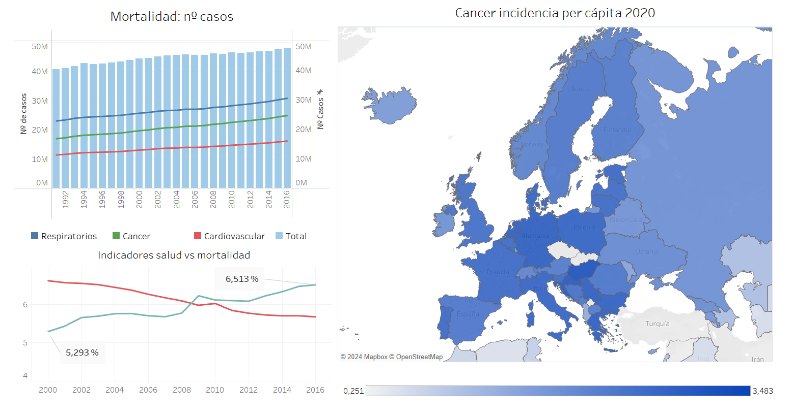
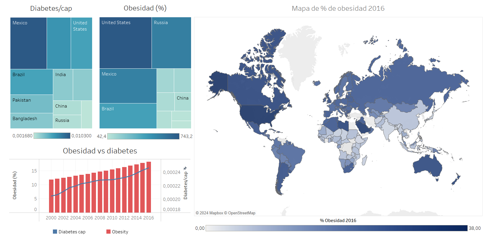

# ANÁLISIS DE LAS CAUSAS DE MUERTE EN EL MUNDO
## _Segundo proyecto de análisis de datos en IRONHACK_

### Descripción:

- Análisis de enfermedades en el mundo.
- Análisis de las patologías que más crecen y decrecen.
- Análisis del cáncer y la obesidad en específico, ya que son las más alarmantes.

### Proceso:

1. Descarga de datos y organización.
2. Limpieza y transformación de los datos para su correcta manipulación posterior.
3. Análisis exploratorio: entender los datos y analizar outliers.
4. Presentación.

### Conlusiones:

En torno al 65% de las muertes en el mundo son consecuencia de 3 enfermedades: las cardiovasculares, respiratorias y cáncer y año tras año, sigue creciendo ese porcentaje. La mortalidad está estrictamente relacionado de manera inversa con la mejora de los avances médicos, conforme más evolucionamos médicamente hablando, la tasa de mortalidad en el mundo se reduce, incluso en países menos desarrollados. El cáncer en europa ataca especialente, en concreto, el valor más alto se da en Hungría: 3,48 muertes por cáncer por cada 1.000 habitantes.

Ha habido tres principales emfermedades (no todas responsables de muertes directamente) que han seguido creciendo de manera alarmante: la obesidad, la diabetes y el cancer. Estados Unidos y México son dos países que están en el top 3 de incidencia de la diabetes y la obesidad. En Estados unidos en 2016 había un 38% de la población con obesidad y se estima que el 8,5% de la población mundial muere por causa de la obesidad.

